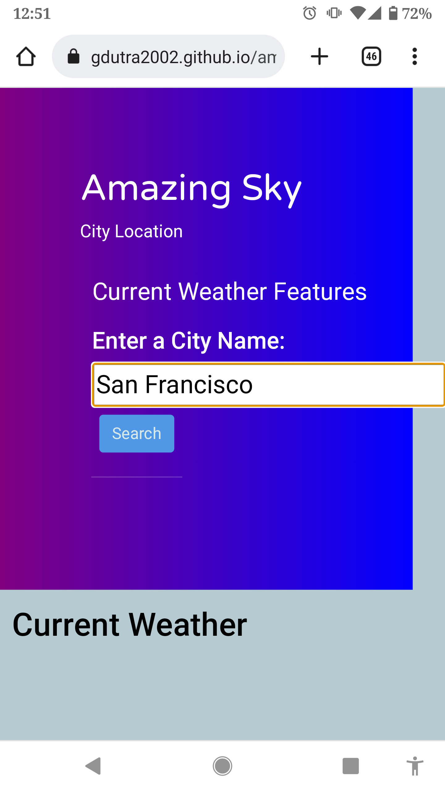
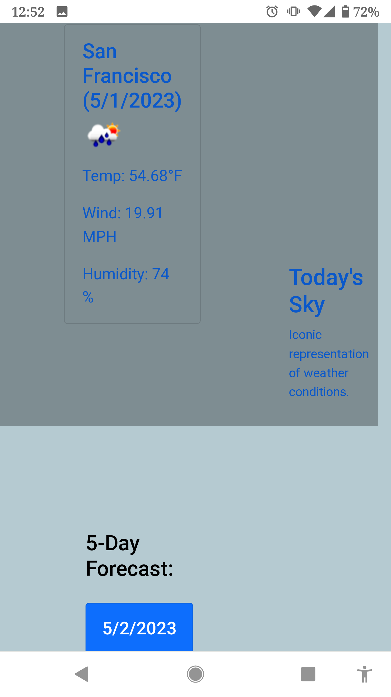
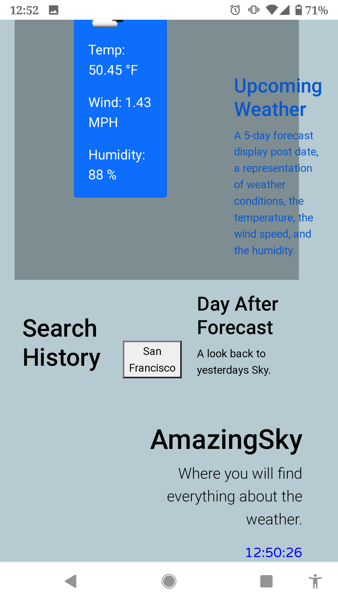

# AmazingSky

## Description

To create a weather app which provides a clear interface for users to search and view current conditions in the city of their selection.  The app displays current, as well as a 5 day forecast of temperature, humidity, and wind speed for the city selected.

The Amazing Sky weather app can be used on any browser or device connected to the internet for a simple stand alone application. 

It utilizes the day.js and OpenWeatherMap API for data based on user search criteria.

## Installation

Simply open the index.html of AmazingSky on any connected browser or device.  Select a City to search in the dialoge box, click the search button.  Your results will be displayed below, including a clickable search history.

https://gdutra2002.github.io/amazingsky/

## Usage

## Credits

https://openweathermap.org
https://day.js.org/

G.D.
UCD

## License

MIT License

## Badges

## How to Contribute

Say hello and contact me thru my portfolio links on github. 
